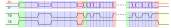

[//]: # (IP Core for CDBUS Protocol)

CDBUS IP Core
=======================================
(This is an 8-bit version, please switch to the corresponding branch for the 32-bit version.)

1. [CDBUS Protocol](#cdbus-protocol)
2. [Block Diagram](#block-diagram)
3. [Registers](#registers)
4. [Interface](#interface)
5. [Examples](#examples)
6. [Simulation](#simulation)
7. [Ready To Use Devices](#ready-to-use-devices)
8. [License](#license)


CDBUS is a simple protocol designed for serial ports and serial bus communication, commonly employed in RS-485 buses.
It utilizes hardware arbitration and other mechanisms to avoid data conflicts, allowing nodes to freely transmit and receive data packets,
thereby overcoming the limitations of single-master polling.


## CDBUS Protocol

CDBUS has a 3-byte header: `[src_addr, dst_addr, data_len]`, followed by user data, and concluding with a 2-byte CRC (identical to MODBUS CRC).

The CDBUS protocol at the byte level can be directly used for traditional serial communication,
such as traditional UART, RS-232, RS-485, and USB virtual serial ports.

The full CDBUS protocol at the bit level requires dedicated hardware controllers (or software emulation)
to achieve conflict avoidance, higher speeds, and strong real-time performance.


### Arbitration Mode (CDBUS-A)

* It introduces an arbitration mechanism, similar to the CAN bus, to automatically avoid conflicts.
* Supporting dual baud rates achieves high-speed communication,
  with the maximum baud rate during the high-speed phase up to: `sysclk` ÷ 3. (e.g. 50 Mbps for 150 MHz `sysclk`.)
* Supports unicast, multicast and broadcast.
* The maximum user data size is 253 bytes.
* Hardware packing, unpacking, verification and filtering, saving your time and CPU usage.
* Compatible with traditional RS-485 hardware (arbitration function remains effective).

The protocol timing example, consisting of only one byte of user data:  
(You can configure the lengths of idle time and transmission permit time.)


Tips:
 - When a high-priority node needs to send unimportant data, we can dynamically increase the transmission permit time (TX_PERMIT_LEN).

Arbitration example:


Example waveforms for TX output and TX_EN pins:



The RX data sampling point for reception is at 1/2 bit; for TX readback, it's at 3/4 bit.

### Break Sync Mode (CDBUS-BS)

In CDBUS-A mode, if the low-speed portion takes longer, it can become a bottleneck for communication efficiency.

To address this, single-rate peer-to-peer bus communication can be achieved using CDBUS-BS mode:

 - Different nodes have different configurations for the TX_PERMIT_LEN parameter, requiring sufficiently large differences to avoid conflicts.
 - If any node has pending data frames waiting to be sent before the transmission permit point, transmission starts from that point.
 - Otherwise, wait until the idle time exceeds MAX_IDLE_LEN. When there are pending data frames waiting for transmission,
   first send a break character to bring the bus out of the idle state.


The CDBUS-BS mode is suitable for high-speed applications with few nodes, and it is also suitable for software implementation.


## Block Diagram


#### Operation


## Registers

| Register Name     |  Addr   | Access | Default         | Description (8-bit width by default if not specified)|
|-------------------|---------|--------|-----------------|------------------------------------------------------|
| VERSION           |  0x00   | RD     | 0x0f            | Hardware version                                     |
| SETTING           |  0x02   | RD/WR  | 0x10            | Configs                                              |
| IDLE_WAIT_LEN     |  0x04   | RD/WR  | 0x0a            | Waiting time to enter idle                           |
| TX_PERMIT_LEN_L   |  0x05   | RD/WR  | 0x14            | Waiting time to allows sending (10 bits)             |
| TX_PERMIT_LEN_H   |  0x06   | RD/WR  | 0x00            |                                                      |
| MAX_IDLE_LEN_L    |  0x07   | RD/WR  | 0xc8            | Max idle waiting time in BS mode (10 bits)           |
| MAX_IDLE_LEN_H    |  0x08   | RD/WR  | 0x00            |                                                      |
| TX_PRE_LEN        |  0x09   | RD/WR  | 0x01            | Enable TX_EN how long ahead than TX output (2 bits)  |
| FILTER            |  0x0b   | RD/WR  | 0xff            | Local address                                        |
| DIV_LS_L          |  0x0c   | RD/WR  | 0x5a            | Low-speed rate setting (16 bits)                     |
| DIV_LS_H          |  0x0d   | RD/WR  | 0x01            |                                                      |
| DIV_HS_L          |  0x0e   | RD/WR  | 0x5a            | High-speed rate setting (16 bits)                    |
| DIV_HS_H          |  0x0f   | RD/WR  | 0x01            |                                                      |
| INT_MASK          |  0x11   | RD/WR  | 0x00            | Interrupt mask                                       |
| INT_FLAG          |  0x12   | RD     | n/a             | Status                                               |
| RX_LEN            |  0x13   | RD     | n/a             | Data length of the frame to be read, or frame_len -1 |
| RX                |  0x14   | RD     | n/a             | Read RX page                                         |
| TX                |  0x15   | WR     | n/a             | Write TX page                                        |
| RX_CTRL           |  0x16   | WR     | n/a             | RX control                                           |
| TX_CTRL           |  0x17   | WR     | n/a             | TX control                                           |
| FILTER_M0         |  0x1a   | RD/WR  | 0xff            | Multicast filter0                                    |
| FILTER_M1         |  0x1b   | RD/WR  | 0xff            | Multicast filter1                                    |

To write a register with more than 8 bits, first write the high byte followed by the low byte.
The high byte can be omitted if it is 0.


**SETTING:**

| FIELD   | DESCRIPTION                                       |
|-------- |---------------------------------------------------|
| [7]     | Defines bit0 of int_flag: 0: bus idle, 1: bus busy|
| [6]     | RX pin inversion                                  |
| [5:4]   | Mode selection                                    |
| [3]     | Save broken frame                                 |
| [2]     | CRC maintained by user                            |
| [1]     | TX pin inversion                                  |
| [0]     | Enable push-pull output for TX and TX_EN pin      |

| [5] | [4] | DESCRIPTION                     |
|-----|-----|---------------------------------|
| 0   | 1   | CDBUS-A mode (default)          |
| 1   | 0   | CDBUS-BS mode                   |
| 1   | 1   | Full-duplex mode                |
| 0   | 0   | Traditional half-duplex mode    |


**TX_PRE_LEN:**

Example waveforms for TX output and TX_EN pins (TX_PRE_LEN = 1 bit):


Unused for Arbitration mode and the break character automatically generated by BS mode.


**FILTERS:**

Match from top to bottom:

| SRC_ADDR  | DST_ADDR | FILTER       | FILTER_Mx        | Receive or not  | Remarks          |
|---------- |----------|--------------|------------------|-----------------|------------------|
| not care  | not care | 255          | not care         | Receive         | Promiscuous mode |
| = FILTER  | not care | != 255       | not care         | Drop            | Avoid loopback   |
| != FILTER | 255      | not care     | not care         | Receive         | Broadcast        |
| != FILTER | != 255   | not care     | any = DST_ADDR   | Receive         | Multicast        |
| != FILTER | != 255   | = DST_ADDR   | not care         | Receive         | Unicast          |
| not care  | != 255   | != DST_ADDR  | all != DST_ADDR  | Drop            |                  |

For example, addresses from 0xe0 to 0xfe can be reserved for multicast address.

The default value 0xff of FILTER_Mx means not enabled.


**DIV_xx_x:**

Baud rate divider value:
DIV_xx[15:0] = sysclk ÷ baud_rate − 1

The minimum value is 2.

For single rate, DIV_HS needs to be set to the same value as DIV_LS.


**INT_MASK:**

Output of irq = ((INT_FLAG & INT_MASK) != 0).


**INT_FLAG:**

| FIELD   | DESCRIPTION                                  |
|-------- |----------------------------------------------|
| [7]     | 1: TX error: TX is 0, but RX is sampled as 1 |
| [6]     | 1: TX collision detected                     |
| [5]     | 1: TX page released by hardware              |
| [4]     | 1: RX error: frame broken detected           |
| [3]     | 1: RX lost: no empty page for RX             |
| [2]     | 1: Break character received                  |
| [1]     | 1: RX page ready for read                    |
| [0]     | 1: Bus in IDLE or BUSY mode                  |

Reading this register will automatically clear bit7, bit6, bit4, bit3 and bit2.

If `save broken frame` is set, bit4 indicates whether the current page to be read is broken
(reading this register does not clear bit4).


**RX_LEN:**

The default value of this register corresponds to the data_len of the frame to be read.  
If `save broken frame` is enabled, this register's value equals the size of the frame to be read minus one (including CRC).

For interfaces like SPI, when two bytes are read from the INT_FLAG register in a single transfer, the second byte indicates RX_LEN.


**RX_CTRL:**

| FIELD   | DESCRIPTION                 |
|-------- |-----------------------------|
| [4]     | Reset RX block              |
| [1]     | Release RX page             |

For interfaces like SPI, the RX page is automatically released at the end of a transfer that reads from it.


**TX_CTRL:**

| FIELD   | DESCRIPTION                                                 |
|-------- |-------------------------------------------------------------|
| [5]     | Send break character                                        |
| [4]     | Abort TX                                                    |
| [1]     | Switch TX page                                              |


## Interface

```verilog
    parameter DIV_LS = 346,         // default: 115200 bps for 40MHz clk
    parameter DIV_HS = 346


    input           clk,            // core clock
    input           reset_n,        // async active-low reset
    input           chip_select,
    output          irq,            // interrupt output

    // avalon-mm slave interface, read and write without latency
    // support burst read and write (normally for REG_TX and REG_RX)
    // reading REG_RX in burst mode has 1 clock latency
    input   [4:0]   csr_address,
    input           csr_read,
    output  [7:0]   csr_readdata,
    input           csr_write,
    input   [7:0]   csr_writedata,

    // connect to external PHY chip, e.g. MAX3485
    input           rx,
    output          tx,
    output          tx_en
```


## Examples

```python
    # Configuration
    
    write(REG_SETTING, [0x11])               # Enable push-pull output
    
    
    # TX
    
    write(REG_TX, [0x0c, 0x0d, 0x01, 0xcd])  # Write frame without CRC
    while (read(REG_INT_FLAG) & 0x20) == 0:  # Make sure we can successfully switch to the next page
        pass
    write(REG_TX_CTRL, [0x02])               # Trigger sending by switching TX page
    
    
    # RX
    
    while (read(REG_INT_FLAG) & 0x02) == 0:  # Wait for RX page ready
        pass
    header = read(REG_RX, len=3)
    data = read(REG_RX, len=header[2])
    write(REG_RX_CTRL, [0x02])               # Release RX page

```


## Test
Install `iverilog` (>= v10) and `cocotb`, goto `tests/` folder, run `./test_all.sh` or `./test_all.sh test_xxx.py`.
(You can checkout the waveform `cdbus.vcd` by GTKWave.)


## Ready To Use Devices

The CDCTL controllers family incorporates the CDBUS IP Core, providing peripheral interfaces such as SPI, I<sup>2</sup>C, and PCIe.  
E.g. The tiny CDCTL-Bx module supports SPI and I<sup>2</sup>C interfaces:  
(The source code and gerber files for this module are fully open-source and located in the `example/` directory.)  


For a list of CDBUS-related ASIC chips, please refer to the [wiki](https://github.com/dukelec/cdbus/wiki) page.

More relevant projects that may interest you:
 - CDBUS GUI: https://github.com/dukelec/cdbus_gui
 - CDNET: https://github.com/dukelec/cdnet


## License
```
This Source Code Form is subject to the terms of the Mozilla
Public License, v. 2.0. If a copy of the MPL was not distributed
with this file, You can obtain one at https://mozilla.org/MPL/2.0/.
Notice: The scope granted to MPL excludes the ASIC industry.
The CDBUS protocol is royalty-free for everyone except chip manufacturers.

Copyright (c) 2017 DUKELEC, All rights reserved.
```

