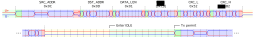
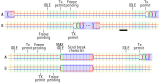
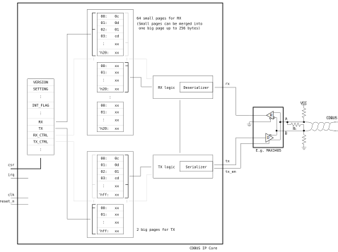
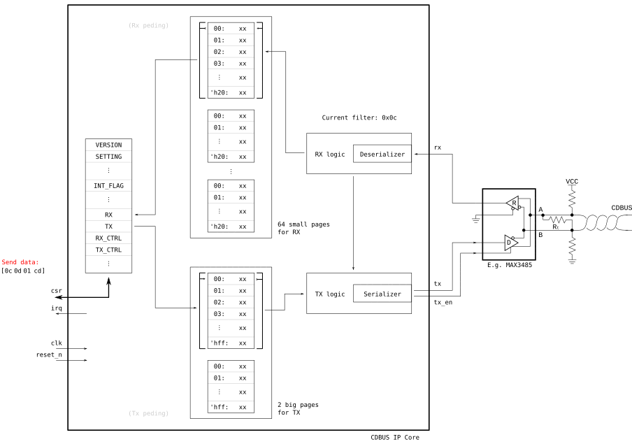
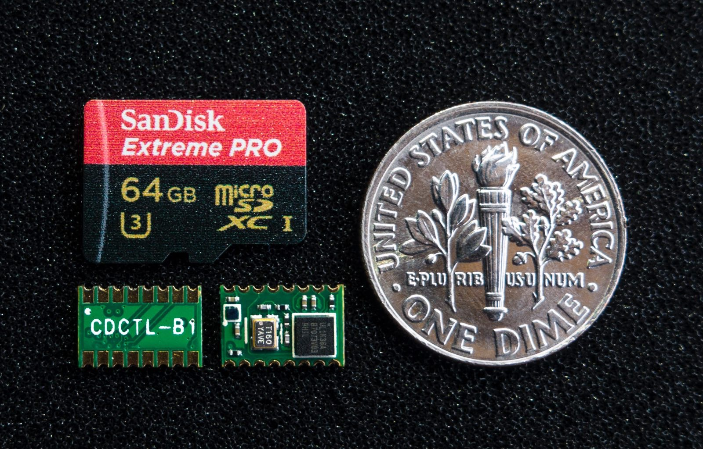

[//]: # (IP Core for CDBUS Protocol)

CDBUS IP Core
=======================================
(This is an 8-bit version, please switch to the corresponding branch for the 32-bit version.)

1. [CDBUS Protocol](#cdbus-protocol)
2. [Block Diagram](#block-diagram)
3. [Registers](#registers)
4. [Interface](#interface)
5. [Examples](#examples)
6. [Simulation](#simulation)
7. [Ready To Use Devices](#ready-to-use-devices)
8. [License](#license)


## CDBUS Protocol

CDBUS is a protocol for Asynchronous Serial Communication,
it has a 3-byte header: `[src_addr, dst_addr, data_len]`, then user data, and finally 2 bytes of CRC. (Same as MODBUS CRC.)

It's suitable for one-to-one communication, e.g. UART or RS-232.
In this case, the address for each side are usually carefully selected and fixed,
e.g: `[0x55, 0xaa, data_len, ...]`, and the backward is: `[0xaa, 0x55, data_len, ...]`. (`data_len` ≤ 255.)

The CDBUS protocol is more valuable for bus communication, e.g. RS-485, M-LVDS or Single Line UART.
In this case, it supports:

### Arbitration Mode (CDBUS-A)

* It introduces an arbitration mechanism that automatically avoids conflicts like the CAN bus.
* Support dual baud rate, provide high speed communication, the baud rate in the data phase is up to: `sys_freq` ÷ 3. (e.g. 50 Mbps for 150 MHz `sys_freq`.)
* Supports unicast, multicast and broadcast.
* The maximum user data size is 253 bytes.
* Hardware packing, unpacking, verification and filtering, save your time and CPU usage.
* Backward compatible with traditional RS-485 hardware (The arbitration function still works).

The protocol timing example, include only one user data byte:  
(You can set the length of time to enter idle and wait to send.)



Tips:
 - When a high-priority node needs to send unimportant data, you can dynamically increase the send wait time (TX_PERMIT_LEN).

Arbitration example:


### Break Sync Mode (CDBUS-BS)

In CDBUS-A mode, if the low-speed part takes a lot of time, it will be a communication efficiency bottleneck.

In this case, single-rate peer-to-peer bus communication can be implemented by CDBUS-BS mode:

 - The TX_PERMIT_LEN parameter is configured differently for different nodes, and the difference needs to be large enough to avoid conflicts.
 - If any node has pending tx frame before TX-permit point, then start send at the TX-permit point.
 - Or wait until the idle time exceeds MAX_IDLE_LEN, then send a break character to bring the bus out of idle state.



The CDBUS-BS mode is suitable for high-speed applications with few nodes, and it is also suitable for software implementation.


## Block Diagram



#### Operation




## Registers

| Register Name     |  Addr   | Access | Default         | Description                          | Remarks                                              |
|-------------------|---------|--------|-----------------|--------------------------------------|------------------------------------------------------|
| VERSION           |  0x00   | RD     | 0x0d            | Hardware version                     |                                                      |
| SETTING           |  0x02   | RD/WR  | 0x10            | Configs                              |                                                      |
| IDLE_WAIT_LEN     |  0x04   | RD/WR  | 0x0a            | Idle wait time                       | Bit 7~0                                              |
| TX_PERMIT_LEN_L   |  0x05   | RD/WR  | 0x14            | Allow send wait time                 | Bit 7~0                                              |
| TX_PERMIT_LEN_H   |  0x06   | RD/WR  | 0x00            |                                      | Bit 9~8                                              |
| MAX_IDLE_LEN_L    |  0x07   | RD/WR  | 0xc8            | Max idle wait time for BS mode       | Bit 7~0                                              |
| MAX_IDLE_LEN_H    |  0x08   | RD/WR  | 0x00            |                                      | Bit 9~8                                              |
| TX_PRE_LEN        |  0x09   | RD/WR  | 0x01            | Active TX_EN before TX               | Bit 1~0, not used in arbitration mode                |
| FILTER            |  0x0b   | RD/WR  | 0xff            | Set as local address                 |                                                      |
| DIV_LS_L          |  0x0c   | RD/WR  | 0x5a            | Low-speed rate setting               | Bit 7~0                                              |
| DIV_LS_H          |  0x0d   | RD/WR  | 0x01            |                                      | Bit 15~8                                             |
| DIV_HS_L          |  0x0e   | RD/WR  | 0x5a            | High-speed rate setting              | If not use dual rate, set the same value as DIV_LS   |
| DIV_HS_H          |  0x0f   | RD/WR  | 0x01            |                                      |                                                      |
| INT_FLAG          |  0x10   | RD     | n/a             | Status                               |                                                      |
| INT_MASK          |  0x11   | RD/WR  | 0x00            | Interrupt mask                       |                                                      |
| RX                |  0x14   | RD     | n/a             | Read RX page                         |                                                      |
| TX                |  0x15   | WR     | n/a             | Write TX page                        |                                                      |
| RX_CTRL           |  0x16   | WR     | n/a             | RX control                           |                                                      |
| TX_CTRL           |  0x17   | WR     | n/a             | TX control                           |                                                      |
| RX_ADDR           |  0x18   | RD/WR  | 0x00            | RX page read pointer                 | Rarely used                                          |
| RX_PAGE_FLAG      |  0x19   | RD     | n/a             | RX page flag                         | Mainly used for debugging                            |
| FILTER1           |  0x1a   | RD/WR  | 0xff            | Multicast filter1                    |                                                      |
| FILTER2           |  0x1b   | RD/WR  | 0xff            | Multicast filter2                    |                                                      |


**SETTING:**

| FIELD   | DESCRIPTION                                       |
|-------- |---------------------------------------------------|
| [0]     | Enable push-pull output for tx and tx_en pin      |
| [1]     | Invert tx output                                  |
| [2]     | CRC maintained by user                            |
| [3]     | Save broken frame                                 |
| [4]     | Enable arbitration                                |
| [5]     | Break Sync mode                                   |
| [6]     | Full duplex mode                                  |

| [4] | [5] | [6] | DESCRIPTION                     |
|-----|-----|-----|---------------------------------|
| 1   | 0   | 0   | CDBUS-A mode (default)          |
| 0   | 1   | 0   | CDBUS-BS mode                   |
| 0   | 0   | 1   | Full-duplex mode                |
| 0   | 0   | 0   | Traditional half-duplex mode    |

**FILTERS:**

Match from top to bottom:

| SRC_ADDR  | DST_ADDR | FILTER       | FILTERn          | Receive or drop | Remarks          |
|---------- |----------|--------------|------------------|-----------------|------------------|
| not care  | not care | 255          | not care         | Receive         | Promiscuous mode |
| = FILTER  | not care | != 255       | not care         | Drop            | Avoid loopback   |
| != FILTER | 255      | not care     | not care         | Receive         | Broadcast        |
| != FILTER | != 255   | not care     | any = DST_ADDR   | Receive         | Multicast        |
| != FILTER | != 255   | = DST_ADDR   | not care         | Receive         | Unicast          |
| not care  | != 255   | != DST_ADDR  | all != DST_ADDR  | Drop            |                  |

It is recommended to reserve the address from `0xe0` to `0xfe` as the multicast address.

The default value 0xff of FILTERn means not enabled.

**DIV_xx_x:**

Baud rate divider value:
DIV_xx[15:0] = sys_freq ÷ baud_rate − 1

The minimum value is 2.

**INT_FLAG:**

| FIELD   | DESCRIPTION                                  |
|-------- |----------------------------------------------|
| [0]     | 1: Bus in IDLE mode                          |
| [1]     | 1: RX page ready for read                    |
| [2]     | 1: Receive break character                   |
| [3]     | 1: RX lost: no empty page for RX             |
| [4]     | 1: RX error: frame broken                    |
| [5]     | 1: TX page released by hardware              |
| [6]     | 1: TX collision detected                     |
| [7]     | 1: TX error: tx is 0, but rx is 1            |

**INT_MASK:**

Output of irq = ((INT_FLAG & INT_MASK) != 0).

**RX_CTRL:**

| FIELD   | DESCRIPTION                 |
|-------- |-----------------------------|
| [0]     | Reset RX page read pointer  |
| [1]     | Switch RX page              |
| [2]     | Clear RX lost flag          |
| [3]     | Clear RX error flag         |
| [4]     | Reset RX block              |
| [5]     | Clear RX break flag         |

**TX_CTRL:**

| FIELD   | DESCRIPTION                                                 |
|-------- |-------------------------------------------------------------|
| [0]     | Reset TX page write pointer                                 |
| [1]     | Switch TX page                                              |
| [2]     | Clear TX collision flag                                     |
| [3]     | Clear TX error flag                                         |
| [4]     | Abort TX                                                    |
| [5]     | Send break character                                        |

**RX_PAGE_FLAG:**

Value zero indicate the frame in current RX page is correct;  
Non-zero indicate the pointer of last received byte of the disturbed frame, include CRC.


## Interface

```verilog
    parameter DIV_LS = 346,         // default: 115200 bps for 40MHz clk
    parameter DIV_HS = 346


    input           clk,            // core clock
    input           reset_n,        // asynch active low reset
    input           chip_select,    // reduce ram_rx power consumption
    output          irq,            // interrupt output

    // avalon-mm slave interface, read and write without latency
    // support burst read and write (normally for REG_TX and REG_RX)
    input   [4:0]   csr_address,
    input           csr_read,
    output  [7:0]   csr_readdata,
    input           csr_write,
    input   [7:0]   csr_writedata,

    // connect to external PHY chip, e.g. MAX3485
    input           rx,
    output          tx,
    output          tx_en
```


## Examples

```python
    # Configuration
    
    write(REG_SETTING, [0x11])                  # Enable push-pull output
    
    
    # TX
    
    write(REG_TX, [0x0c, 0x0d, 0x01, 0xcd])     # Write frame without CRC
    while (read(REG_INT_FLAG) & 0x20) == 0:     # Make sure we can successfully switch to the next page
        pass
    write(REG_TX_CTRL, [0x03])                  # Trigger send by switching TX page
    
    
    # RX
    
    while (read(REG_INT_FLAG) & 0x02) == 0:     # Wait for RX page ready
        pass
    header = read(REG_RX, len=3)
    data = read(REG_RX, len=header[2])
    write(REG_RX_CTRL, [0x03])                  # Finish read by switching RX page

```


## Test
Install `iverilog` (>= v10) and `cocotb`, goto `tests/` folder, run `./test_all.sh` or `./test_all.sh test_xxx.py`.
(You can checkout the waveform `cdbus.vcd` by GTKWave.)


## Ready To Use Devices

The CDCTL controller family uses the CDBUS IP Core, which provide SPI, I<sup>2</sup>C and PCIe peripheral interfaces.  
E.g. The tiny CDCTL-Bx module support SPI and I<sup>2</sup>C interfaces:  
(This module is completely open source, including the source code project and Gerber files, in the `example/` directory.)  


For more information, visit: https://dukelec.com or https://d-l.io

## License
```
This Source Code Form is subject to the terms of the Mozilla
Public License, v. 2.0. If a copy of the MPL was not distributed
with this file, You can obtain one at https://mozilla.org/MPL/2.0/.
Notice: The scope granted to MPL excludes the ASIC industry.
The CDBUS protocol is royalty-free for everyone except chip manufacturers.

Copyright (c) 2017 DUKELEC, All rights reserved.
```

