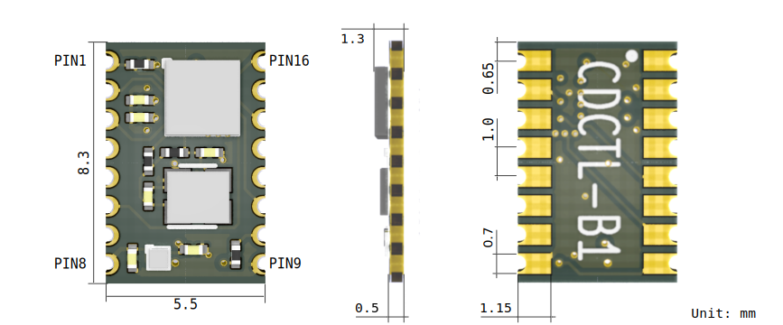
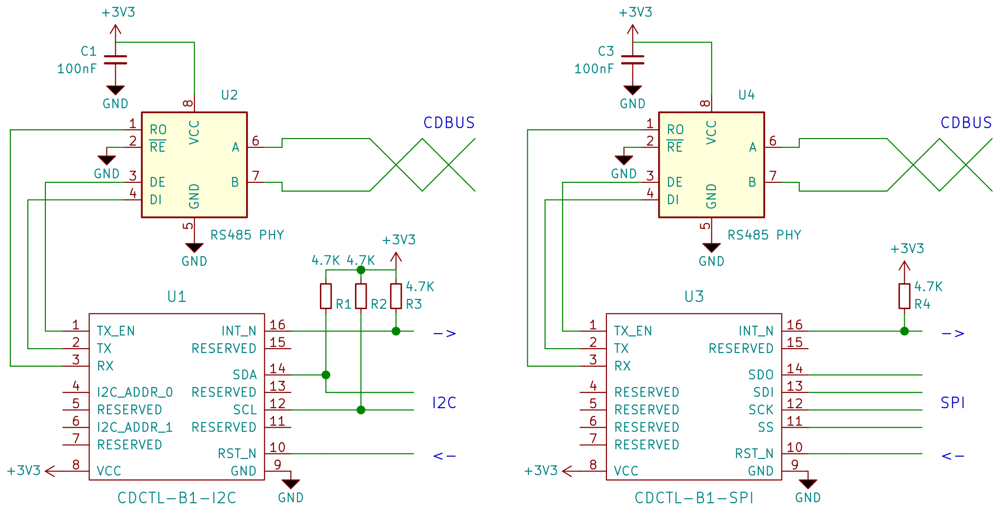

CDBUS IP Example
=======================================
This is CDCTL-B (or CDCTL-H as well) module project, which consists of an SPI (or I2C) interface and a CDBUS IP.
The following is the protocol for the SPI and I2C interfaces.

  

## SPI

Read or write depend by bit W/R̅ :  
 - 0: Read
 - 1: Write

| FIELD   | DESCRIPTION         |
|-------- |---------------------|
| Ax      | Register address    |
| Wx      | Write data          |
| Rx      | Read data           |
| X       | Don't care          |

Read or write single byte:  

Burst read or write:  

## I2C

| FIELD   | DESCRIPTION                                                     |
|-------- |-----------------------------------------------------------------|
| DAx     | I2C device address, DA0 & 1 set by I2C_ADDR_x pins   |
| Ax      | Register address                                                |
| Wx      | Write data                                                      |
| Rx      | Read data                                                       |
| X       | Don't care                                                      |
| D       | ACK by device                                                   |
| H       | ACK by host                                                     |
| N       | Host don’t ACK after read last byte                             |

### Write

### Read

Write register address first, then read back:  

Burst read back:  

